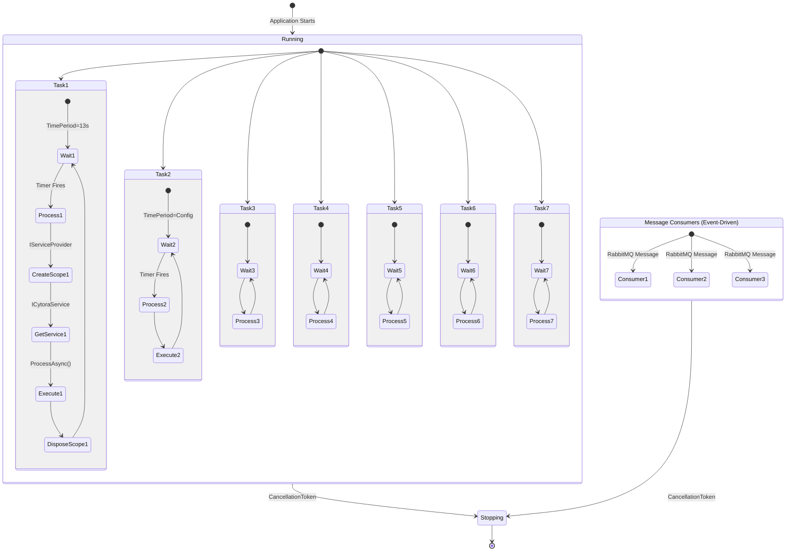

```mermaid
stateDiagram-v2
    [*] --> Running: Application Starts

    state Running {
        [*] --> Task1
        [*] --> Task2
        [*] --> Task3
        [*] --> Task4
        [*] --> Task5
        [*] --> Task6
        [*] --> Task7
        
        state Task1 {
            [*] --> Wait1: TimePeriod=13s
            Wait1 --> Process1: Timer Fires
            Process1 --> CreateScope1: IServiceProvider
            CreateScope1 --> GetService1: ICytoraService
            GetService1 --> Execute1: ProcessAsync()
            Execute1 --> DisposeScope1
            DisposeScope1 --> Wait1
        }
        
        state Task2 {
            [*] --> Wait2: TimePeriod=Config
            Wait2 --> Process2: Timer Fires
            Process2 --> Execute2
            Execute2 --> Wait2
        }
        
        state Task3 {
            [*] --> Wait3
            Wait3 --> Process3
            Process3 --> Wait3
        }
        
        state Task4 {
            [*] --> Wait4
            Wait4 --> Process4
            Process4 --> Wait4
        }
        
        state Task5 {
            [*] --> Wait5
            Wait5 --> Process5
            Process5 --> Wait5
        }
        
        state Task6 {
            [*] --> Wait6
            Wait6 --> Process6
            Process6 --> Wait6
        }
        
        state Task7 {
            [*] --> Wait7
            Wait7 --> Process7
            Process7 --> Wait7
        }
    }

    state "Message Consumers (Event-Driven)" as Consumers {
        [*] --> Consumer1: RabbitMQ Message
        [*] --> Consumer2: RabbitMQ Message
        [*] --> Consumer3: RabbitMQ Message
    }

    Running --> Stopping: CancellationToken
    Consumers --> Stopping: CancellationToken
    Stopping --> [*]
```
