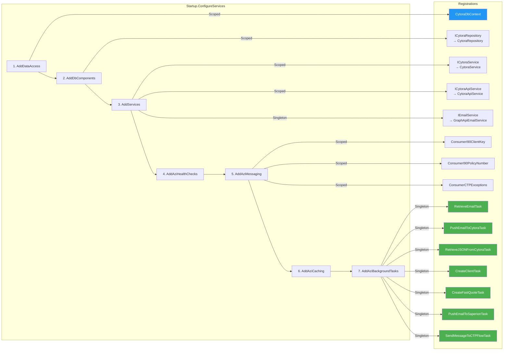

```mermaid
graph LR
    subgraph "Startup.ConfigureServices"
        A[1. AddDataAccess] --> B[2. AddDbComponents]
        B --> C[3. AddServices]
        C --> D[4. AddAziHealthChecks]
        D --> E[5. AddAziMessaging]
        E --> F[6. AddAziCaching]
        F --> G[7. AddAziBackgroundTasks]
    end

    subgraph "Registrations"
        A -->|Scoped| DbContext[CytoraDbContext]
        B -->|Scoped| Repo[ICytoraRepository<br/>→ CytoraRepository]
        C -->|Scoped| Service1[ICytoraService<br/>→ CytoraService]
        C -->|Scoped| Service2[ICytoraApiService<br/>→ CytoraApiService]
        C -->|Singleton| Service3[IEmailService<br/>→ GraphApiEmailService]
        E -->|Scoped| Consumer1[ConsumerI90ClientKey]
        E -->|Scoped| Consumer2[ConsumerI90PolicyNumber]
        E -->|Scoped| Consumer3[ConsumerCTPExceptions]
        G -->|Singleton| Task1[RetrieveEmailTask]
        G -->|Singleton| Task2[PushEmailToCytoraTask]
        G -->|Singleton| Task3[RetrieveJSONFromCytoraTask]
        G -->|Singleton| Task4[CreateClientTask]
        G -->|Singleton| Task5[CreateFastQuoteTask]
        G -->|Singleton| Task6[PushEmailToSaperionTask]
        G -->|Singleton| Task7[SendMessageToCTPFlowTask]
    end

    style DbContext fill:#2196F3,color:#fff
    style Task1 fill:#4CAF50,color:#fff
    style Task2 fill:#4CAF50,color:#fff
    style Task3 fill:#4CAF50,color:#fff
    style Task4 fill:#4CAF50,color:#fff
    style Task5 fill:#4CAF50,color:#fff
    style Task6 fill:#4CAF50,color:#fff
    style Task7 fill:#4CAF50,color:#fff
```
