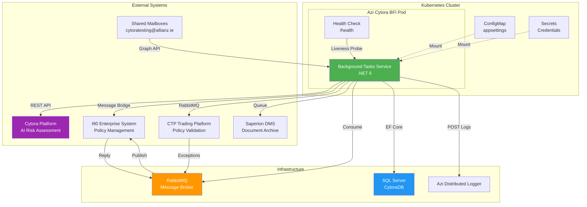

```mermaid
graph TB
    subgraph "External Systems"
        Email[Shared Mailboxes<br/>cytoratesting@allianz.ie]
        Cytora[Cytora Platform<br/>AI Risk Assessment]
        I90[I90 Enterprise System<br/>Policy Management]
        CTP[CTP Trading Platform<br/>Policy Validation]
        Saperion[Saperion DMS<br/>Document Archive]
    end

    subgraph "Kubernetes Cluster"
        subgraph "Azi Cytora BFI Pod"
            App[Background Tasks Service<br/>.NET 6]
            Health[Health Check<br/>/health]
        end
        ConfigMap[ConfigMap<br/>appsettings]
        Secrets[Secrets<br/>Credentials]
    end

    subgraph "Infrastructure"
        RabbitMQ[RabbitMQ<br/>Message Broker]
        SQL[SQL Server<br/>CytoraDB]
        Logger[Azi Distributed Logger]
    end

    Email -->|Graph API| App
    App -->|REST API| Cytora
    App -->|Message Bridge| I90
    App -->|RabbitMQ| CTP
    App -->|Queue| Saperion
    
    App -->|Consume| RabbitMQ
    RabbitMQ -->|Publish| I90
    I90 -->|Reply| RabbitMQ
    CTP -->|Exceptions| RabbitMQ
    
    App -->|EF Core| SQL
    App -->|POST Logs| Logger
    
    ConfigMap -.->|Mount| App
    Secrets -.->|Mount| App
    
    Health -->|Liveness Probe| App

    style App fill:#4CAF50,color:#fff
    style SQL fill:#2196F3,color:#fff
    style RabbitMQ fill:#FF9800,color:#fff
    style Cytora fill:#9C27B0,color:#fff
```
