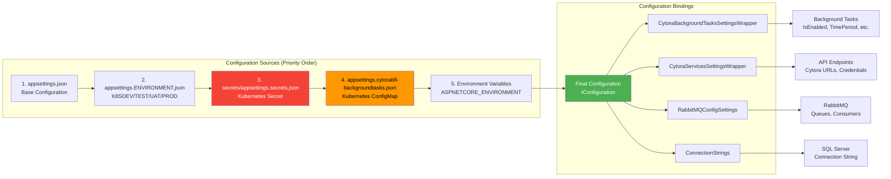

# Configuration Hierarchy

[← Back to Diagrams Index](../ARCHITECTURE_DIAGRAMS.md)

---

## Diagram

---

See [Configuration Hierarchy](10_Configuration.md) for complete configuration details.

---

**Last Updated:** January 21, 2026
