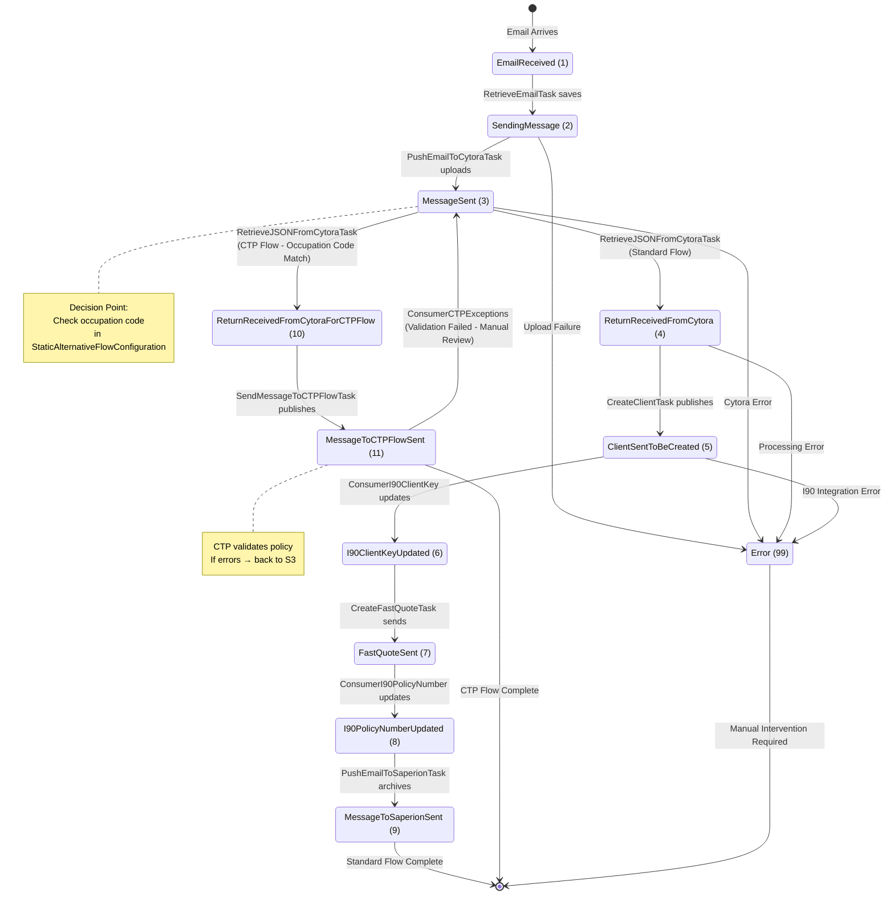

# Message Flow State Machine

[← Back to Diagrams Index](../ARCHITECTURE_DIAGRAMS.md)

---

## Overview

This state machine diagram shows the 11 workflow states plus 1 error state that messages transition through during processing.

---

## Diagram



---

## Status Definitions

| ID | Status Name | Description | Triggered By |
|----|-------------|-------------|--------------|
| 1 | EmailReceived | Email saved to database | RetrieveEmailTask |
| 2 | SendingMessage | Uploading to Cytora | PushEmailToCytoraTask |
| 3 | MessageSent | Uploaded to Cytora, awaiting processing | PushEmailToCytoraTask |
| 4 | ReturnReceivedFromCytora | Risk assessment received (Standard) | RetrieveJSONFromCytoraTask |
| 5 | ClientSentToBeCreated | Sent to I90 for client creation | CreateClientTask |
| 6 | I90ClientKeyUpdated | Client created in I90 | ConsumerI90ClientKey |
| 7 | FastQuoteSent | Quote sent to I90 | CreateFastQuoteTask |
| 8 | I90PolicyNumberUpdated | Policy created in I90 | ConsumerI90PolicyNumber |
| 9 | MessageToSaperionSent | **✅ Archived to Saperion (Complete)** | PushEmailToSaperionTask |
| 10 | ReturnReceivedFromCytoraForCTPFlow | Risk assessment received (CTP) | RetrieveJSONFromCytoraTask |
| 11 | MessageToCTPFlowSent | **✅ Sent to CTP (Complete)** | SendMessageToCTPFlowTask |
| 99 | Error | **❌ Error state, manual intervention** | Any task |

---

## Flow Routing Decision

At **Status 3** (MessageSent), the system decides which flow to follow:

### Decision Logic
```csharp
// In RetrieveJSONFromCytoraTask
var occupationCode = transformedRecord.OccupationCode;
var productIdentifier = cytoraMessageDB.MailboxIdentifier;

var isAlternativeFlow = alternativeFlowConfigurations.Any(c => 
    c.OccupationCode == occupationCode && 
    c.ProductIdentifier == productIdentifier &&
    c.FlowIdentifier == "CTP");

if (isAlternativeFlow)
    await cytoraService.UpdateStatus(messageId, CytoraMessageStatus.ReturnReceivedFromCytoraForCTPFlow); // 10
else
    await cytoraService.UpdateStatus(messageId, CytoraMessageStatus.ReturnReceivedFromCytora); // 4
```

### Routing Table
```sql
SELECT OccupationCode, FlowIdentifier, ProductIdentifier
FROM StaticAlternativeFlowConfiguration
WHERE FlowIdentifier = 'CTP'
-- 200+ occupation codes route to CTP flow
```

---

## Flow Paths

### Standard Flow (Status 1 → 9)
```
EmailReceived (1)
  → SendingMessage (2)
  → MessageSent (3)
  → ReturnReceivedFromCytora (4)
  → ClientSentToBeCreated (5)
  → I90ClientKeyUpdated (6)
  → FastQuoteSent (7)
  → I90PolicyNumberUpdated (8)
  → MessageToSaperionSent (9) ✅
```

**Duration:** ~30-60 minutes (depends on Cytora + I90 processing)

### CTP Flow (Status 1 → 11)
```
EmailReceived (1)
  → SendingMessage (2)
  → MessageSent (3)
  → ReturnReceivedFromCytoraForCTPFlow (10)
  → MessageToCTPFlowSent (11) ✅
```

**Duration:** ~15-30 minutes

### Exception Recovery (Status 11 → 3)
```
MessageToCTPFlowSent (11)
  → CTP Validation Fails
  → ConsumerCTPExceptions patches Cytora
  → MessageSent (3) (revert for manual review)
```

---

## Database Queries by Status

### Query Messages by Status
```sql
-- Get all messages in a specific status
SELECT Id, CytoraId, Subject, CreatedOn, UpdatedOn
FROM CytoraMessage
WHERE StatusId = 3; -- MessageSent

-- Get status distribution
SELECT s.Name, COUNT(*) as Count
FROM CytoraMessage cm
INNER JOIN CytoraMessageStatus s ON cm.StatusId = s.Id
GROUP BY s.Name;
```

### Check for Stuck Messages
```sql
-- Messages stuck in processing (> 1 hour)
SELECT Id, StatusId, UpdatedOn
FROM CytoraMessage
WHERE StatusId IN (2, 5, 7) 
  AND UpdatedOn < DATEADD(HOUR, -1, GETDATE());
```

---

## Error State Handling

Messages enter **Status 99** (Error) when:
- Cytora API returns 4xx/5xx errors
- I90 integration fails permanently
- Database constraint violations
- Unexpected exceptions

**Recovery:**
```sql
-- Manually reset to re-process
UPDATE CytoraMessage
SET StatusId = 1, UpdatedOn = GETDATE()
WHERE Id = '{guid}' AND StatusId = 99;
```

---

## Monitoring

Track workflow progress:
```sql
-- Average time in each status
SELECT s.Name,
       AVG(DATEDIFF(MINUTE, cm.CreatedOn, cm.UpdatedOn)) as AvgMinutes
FROM CytoraMessage cm
INNER JOIN CytoraMessageStatus s ON cm.StatusId = s.Id
WHERE cm.StatusId >= 9 -- Completed messages
GROUP BY s.Name;
```

---

## Next Steps

- [← Background Task Orchestration](04_Task_Orchestration.md)
- [Standard Flow Sequence →](06_Standard_Flow.md)
- [Alternative CTP Flow Sequence →](07_CTP_Flow.md)

---

**Last Updated:** January 21, 2026
